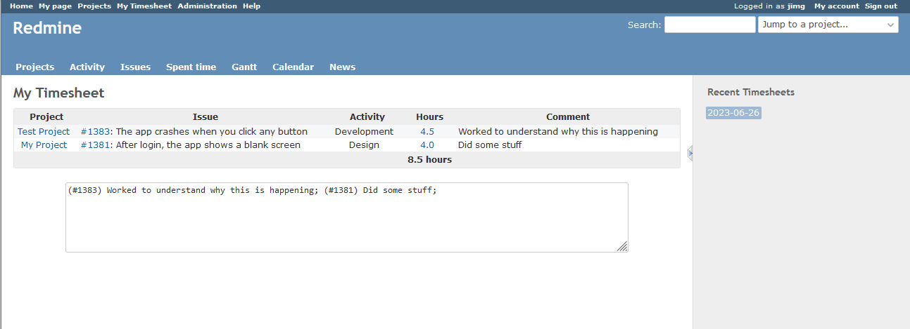

# Redmine Timesheet Summary Plugin

This is a very simple Redmine plugin that shows you a summary of the time entries made over the day. The global plugin groups all your time entries for a day, collecting them into a nice summary view that you can use for whatever you like. We used the plugin to summarize our activities in other tracking systems.

The plugin adds a 'My Timesheet' link at the global menu at the top of the page. Once in the app, there is a list of upto 10 days of timesheets.

## Supported Versions

* Currently only tested in Redmine v5.0.5. It should work back to Redmine v3. 

## Installation

1. Simply clone this repository into your Redmine's `plugin/` directory.
2. No database migration is needed.
4. Restart Redmine.

## Activation

No activation is needed, it is globally visible and anyone can use it.

## License

The source code for the site is licensed under the MIT license, which you can find in the LICENSE.txt file.

